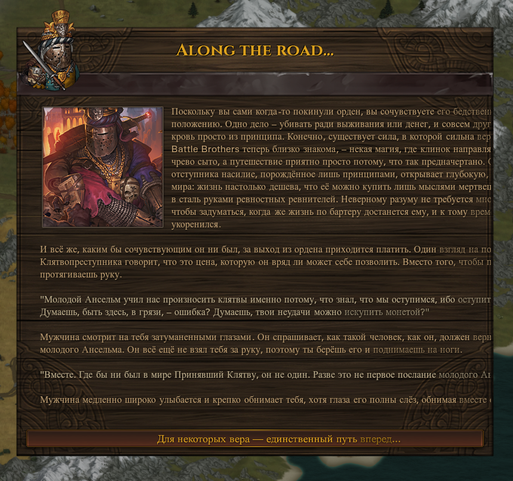

# Of Flesh and Faith+ - Russian Translation Proof of Concept

A partial, proof of concept translation of my [Of Flesh and Faith+](https://github.com/jcsato/of_flesh_and_faith_plus) mod for the game Battle Brothers ([Steam](https://store.steampowered.com/app/365360/Battle_Brothers/), [GOG](https://www.gog.com/game/battle_brothers), [Developer Site](http://battlebrothersgame.com/buy-battle-brothers/)).

## Table of contents

-   [Features](#features)
-   [Requirements](#requirements)
-   [Installation](#installation)
-   [Uninstallation](#uninstallation)

## Features

<div style="width:1200;display:flex;justify-content:center;">
    
</div>

This translation is both incomplete and low quality - I used very basic machine tools for the actual translation, and I'm quite confident the results are primitive. More than to provide an actual translation, the purpose of this path is to provide a working example of how to replace text in-game using mod hooks. Doing avoids issues with redistributing entire altered (often outdated) copies of the original mod and can make debugging issues easier for both translators and mod authors.

For each file in the original mod that needs translations, I created a corresponding file in `script_hooks/`. Files prefixed with `offp_r_h_` modify files in the original Of Flesh and Faith+ mod's `script_hooks/` folder, and files prefixed with `offp_r_s_` modify files in the original's `scripts/` folder - but you can use whatever structure makes sense to you. As you can see, I didn't actually do this for _ALL_ the original files. My intent was just to provide a starting point for others to build on.

Let's examine [`script_hooks/offp_r_s_oathtakers_intro_event.nut`](./script_hooks/offp_r_s_oathtakers_intro_event.nut) more closely:

```lua
::mods_hookNewObject("events/offplus_oathtakers_events/scenario/oathtakers_intro_event", function(oavoe) {

}
```

This uses `mods_hookNewObject` from [Modding Script Hooks](https://www.nexusmods.com/battlebrothers/mods/42) to modifying the `oathtakers_intro_event` file in the original mod (which you can see [here](https://github.com/jcsato/of_flesh_and_faith_plus/blob/master/scripts/events/offplus_oathtakers_events/scenario/oathtakers_intro_event.nut)). Note how the file path has to match, ignoring the `scripts/` piece at the beginning. This tells the script to modify that specific event, and to refer to it in code with the name `oavoe`.

```lua
local aScreen = null;

foreach (screen in oavoe.m.Screens) {
    switch (screen.ID) {
        case "A":
            aScreen = screen;
            break;
    }
}
```

Next we need to find the screen we want to modify. This intro event only has one screen, with an ID of `"A"`. When we find that screen, we save it to a variable (`aScreen`) so that we can modify it.

```lua
if (aScreen != null) {
    aScreen.Text = "[img]gfx/ui/events/event_180.png[/img]{Прошло уже немало времени с тех пор, как ты покинул Берущих Клятвы, и ты ни дня об этом не пожалел. Клятвы были удушающими и постоянными, тебе даже не довелось подержать череп юного Ансельма, а последний раз ты слышал о каком-то провале, когда Берущий Клятву украл у юноши выдающуюся челюсть. Само собой, ты был не слишком рад, когда сегодня утром открыл дверь и встретил двух Берущих Клятвы, %oathtaker1% и %oathtaker2%.\n\nСначала ты подумал, что это убийцы, посланные отомстить за какое-то воображаемое отступничество, которое ты совершил, уйдя, но младший из них предлагает тебе мешок золота, прежде чем ты успеешь обнажить меч.%SPEECH_ON%Для ордена наступили тёмные времена. Зло крадётся по всем уголкам мира, и мы вдвоем не сможем искоренить его в одиночку. Берущим Клятвы нужны новые люди, но эти несколько корон — всё, что у нас есть. Наши таланты годятся лишь для наёмничества, но к тёмным делишкам в домах старейшин и покоях знати мы не имеем никакого отношения. Нам нужна помощь.%SPEECH_OFF%Вы осматриваете золото. Это солидная сумма для одного человека, но скудные средства для целой роты наёмников. Затем старший из двух мужчин достаёт завёрнутый в кожу свёрток пергамента — так называемую Книгу Клятв, хотя её проклятое содержимое кажется скуднее, чем вы помните, — и знакомый полированный череп. Юный Ансельм. Вы потеряли связь с организацией, но вид немой головы этого парня всё ещё вызывает трепет в вашем сердце.%SPEECH_ON%Немногие Клятвы, которые мы смогли сохранить, и самая ценная реликвия нашего ордена. Под их руководством и вашей проницательностью наше предприятие наверняка увенчается успехом!%SPEECH_OFF%У вас есть только одно условие: вы примете Клятву Капитана, а это значит, что все сражения и суровые испытания достанутся другим. Принявшие Клятву без колебаний соглашаются, и с этим вы отправляетесь в путь.}"
    aScreen.Options[0].Text = "За золото, славу и молодого Ансельма!";
}
```

Lastly, we modify the screen's `Text` to change the text of the event to whatever our translated version is. `aScreen.Options[0].Text` does the same thing for the button at the bottom of the screen.

That's it! As you can see some of the other files are slightly more complicated, but they all follow this same general approach. While the example is for Russian, the same principle applies to any other language.

This patch is, by design, quite crude. Subjectively, I feel that this makes it easier to understand and get something working. That said, there are more elegant solutions to translating Battle Brothers mods out there, such as [Hackflow's Rosetta](https://github.com/Suor/battle-brothers-rosetta). I strongly encourage you to give that a look as well.

I've provided (again, fully machine translated, probably terrible) translations of the above in Russian, Simplified Chinese, and Brazilian Portuguese. This is only because I know there are already Battle Brothers modding communities in those languages, and it's my hope that doing some bare-minimum legwork here makes it easier for those communities to find and use this as a resource. Thanks for reading!

**Русский машинный перевод:**

Этот перевод является как неполным, так и низкокачественным — я использовал очень простые машинные инструменты для перевода, и я вполне уверен, что результаты примитивны. Вместо того чтобы предоставить настоящий перевод, цель этого пути — показать рабочий пример того, как заменять текст в игре с помощью хуков модов. Это позволяет избежать проблем с перераспределением целых изменённых (часто устаревших) копий оригинального мода и может упростить отладку как для переводчиков, так и для авторов модов.

Для каждого файла в оригинальном моде, требующего перевода, я создал соответствующий файл в папке `script_hooks/`. Файлы, начинающиеся с `offp_r_h_`, изменяют файлы в папке `script_hooks/` оригинального мода `Of Flesh and Faith+`, а файлы, начинающиеся с `offp_r_s_`, изменяют файлы в папке `scripts/` оригинала — но вы можете использовать любую структуру, которая вам подходит. Как видите, я не делал этого для ВСЕХ оригинальных файлов. Моя цель заключалась лишь в том, чтобы предоставить отправную точку для дальнейшей работы других.

Давайте подробнее рассмотрим файл [`script_hooks/offp_r_s_oathtakers_intro_event.nut`](./script_hooks/offp_r_s_oathtakers_intro_event.nut):

```lua
::mods_hookNewObject("events/offplus_oathtakers_events/scenario/oathtakers_intro_event", function(oavoe) {

}
```

Этот код использует `mods_hookNewObject` из [Modding Script Hooks](https://www.nexusmods.com/battlebrothers/mods/42) для изменения файла oathtakers_intro_event в оригинальном моде (который можно найти [здесь](https://github.com/jcsato/of_flesh_and_faith_plus/blob/master/scripts/events/offplus_oathtakers_events/scenario/oathtakers_intro_event.nut)). Обратите внимание, что путь к файлу должен совпадать, игнорируя часть `scripts/` в начале. Это указывает скрипту изменять именно этот конкретный событие и ссылаться на него в коде с именем `oavoe`.

```lua
local aScreen = null;

foreach (screen in oavoe.m.Screens) {
    switch (screen.ID) {
        case "A":
            aScreen = screen;
            break;
    }
}
```

Теперь нам нужно найти экран, который мы хотим изменить. Это вводное событие содержит только один экран с ID `"A"`. Когда мы находим этот экран, мы сохраняем его в переменную (`aScreen`), чтобы затем изменить.

```lua
if (aScreen != null) {
    aScreen.Text = "[img]gfx/ui/events/event_180.png[/img]{Прошло уже немало времени с тех пор, как ты покинул Берущих Клятвы, и ты ни дня об этом не пожалел. Клятвы были удушающими и постоянными, тебе даже не довелось подержать череп юного Ансельма, а последний раз ты слышал о каком-то провале, когда Берущий Клятву украл у юноши выдающуюся челюсть. Само собой, ты был не слишком рад, когда сегодня утром открыл дверь и встретил двух Берущих Клятвы, %oathtaker1% и %oathtaker2%.\n\nСначала ты подумал, что это убийцы, посланные отомстить за какое-то воображаемое отступничество, которое ты совершил, уйдя, но младший из них предлагает тебе мешок золота, прежде чем ты успеешь обнажить меч.%SPEECH_ON%Для ордена наступили тёмные времена. Зло крадётся по всем уголкам мира, и мы вдвоем не сможем искоренить его в одиночку. Берущим Клятвы нужны новые люди, но эти несколько корон — всё, что у нас есть. Наши таланты годятся лишь для наёмничества, но к тёмным делишкам в домах старейшин и покоях знати мы не имеем никакого отношения. Нам нужна помощь.%SPEECH_OFF%Вы осматриваете золото. Это солидная сумма для одного человека, но скудные средства для целой роты наёмников. Затем старший из двух мужчин достаёт завёрнутый в кожу свёрток пергамента — так называемую Книгу Клятв, хотя её проклятое содержимое кажется скуднее, чем вы помните, — и знакомый полированный череп. Юный Ансельм. Вы потеряли связь с организацией, но вид немой головы этого парня всё ещё вызывает трепет в вашем сердце.%SPEECH_ON%Немногие Клятвы, которые мы смогли сохранить, и самая ценная реликвия нашего ордена. Под их руководством и вашей проницательностью наше предприятие наверняка увенчается успехом!%SPEECH_OFF%У вас есть только одно условие: вы примете Клятву Капитана, а это значит, что все сражения и суровые испытания достанутся другим. Принявшие Клятву без колебаний соглашаются, и с этим вы отправляетесь в путь.}"
    aScreen.Options[0].Text = "За золото, славу и молодого Ансельма!";
}
```

В конце концов, мы изменяем `Text` экрана, чтобы заменить текст события на переведённую версию. `aScreen.Options[0].Text` делает то же самое для кнопки внизу экрана.

Вот и всё! Как видите, некоторые другие файлы немного сложнее, но все они следуют тому же общему подходу. Хотя пример приведён для русского языка, тот же принцип можно применить к любому другому языку.

Этот патч по своей сути довольно груб. Субъективно, мне кажется, что это облегчает понимание и работу. Тем не менее, существуют более элегантные решения для перевода модов для Battle Brothers, такие как [Hackflow's Rosetta](https://github.com/Suor/battle-brothers-rosetta). Я настоятельно рекомендую ознакомиться с ним также.

**中文（简体）机器翻译:**

这个翻译既不完整也不高质量——我使用了非常基础的机器翻译工具，且我非常确信结果是原始的。这个路径的目的并不仅仅是提供一个实际的翻译，更重要的是提供一个如何使用 mod 钩子在游戏中替换文本的工作示例。这样做可以避免重新分发完整的修改版（通常是过时的）原始模组，也能让调试工作对翻译人员和模组作者来说更加轻松。

对于需要翻译的原始模组中的每个文件，我都在 `script_hooks/` 文件夹中创建了相应的文件。以 `offp_r_h_` 开头的文件修改原始《Flesh and Faith+》模组中的 `script_hooks/` 文件夹中的文件，而以 `offp_r_s_` 开头的文件则修改原始模组的 `scripts/` 文件夹中的文件——但你可以根据自己的需求使用任何合适的结构。正如你所见，我并没有为所有原始文件都进行修改。我只是想为其他人提供一个可以继续开发的起点。

让我们仔细看看 [`script_hooks/offp_r_s_oathtakers_intro_event.nut`](./script_hooks/offp_r_s_oathtakers_intro_event.nut) 文件：

```lua
::mods_hookNewObject("events/offplus_oathtakers_events/scenario/oathtakers_intro_event", function(oavoe) {

}
```

这段代码使用了来自 [Modding Script Hooks](https://www.nexusmods.com/battlebrothers/mods/42) `mods_hookNewObject` 来修改原始模组中的 `oathtakers_intro_event` 文件（你可以在 [这里](https://github.com/jcsato/of_flesh_and_faith_plus/blob/master/scripts/events/offplus_oathtakers_events/scenario/oathtakers_intro_event.nut) 查看）。请注意，文件路径必须匹配，只需忽略开头的 `scripts/` 部分。这将告诉脚本修改这个特定的事件，并且在代码中使用 `oavoe` 来引用它。

```lua
local aScreen = null;

foreach (screen in oavoe.m.Screens) {
    switch (screen.ID) {
        case "A":
            aScreen = screen;
            break;
    }
}
```

接下来，我们需要找到要修改的屏幕。这个介绍事件只有一个屏幕，ID 是 `"A"`。当我们找到这个屏幕时，将其保存到一个变量 (`aScreen`)，以便之后进行修改。

```lua
if (aScreen != null) {
    aScreen.Text = "[img]gfx/ui/events/event_180.png[/img]{Прошло уже немало времени с тех пор, как ты покинул Берущих Клятвы, и ты ни дня об этом не пожалел. Клятвы были удушающими и постоянными, тебе даже не довелось подержать череп юного Ансельма, а последний раз ты слышал о каком-то провале, когда Берущий Клятву украл у юноши выдающуюся челюсть. Само собой, ты был не слишком рад, когда сегодня утром открыл дверь и встретил двух Берущих Клятвы, %oathtaker1% и %oathtaker2%.\n\nСначала ты подумал, что это убийцы, посланные отомстить за какое-то воображаемое отступничество, которое ты совершил, уйдя, но младший из них предлагает тебе мешок золота, прежде чем ты успеешь обнажить меч.%SPEECH_ON%Для ордена наступили тёмные времена. Зло крадётся по всем уголкам мира, и мы вдвоем не сможем искоренить его в одиночку. Берущим Клятвы нужны новые люди, но эти несколько корон — всё, что у нас есть. Наши таланты годятся лишь для наёмничества, но к тёмным делишкам в домах старейшин и покоях знати мы не имеем никакого отношения. Нам нужна помощь.%SPEECH_OFF%Вы осматриваете золото. Это солидная сумма для одного человека, но скудные средства для целой роты наёмников. Затем старший из двух мужчин достаёт завёрнутый в кожу свёрток пергамента — так называемую Книгу Клятв, хотя её проклятое содержимое кажется скуднее, чем вы помните, — и знакомый полированный череп. Юный Ансельм. Вы потеряли связь с организацией, но вид немой головы этого парня всё ещё вызывает трепет в вашем сердце.%SPEECH_ON%Немногие Клятвы, которые мы смогли сохранить, и самая ценная реликвия нашего ордена. Под их руководством и вашей проницательностью наше предприятие наверняка увенчается успехом!%SPEECH_OFF%У вас есть только одно условие: вы примете Клятву Капитана, а это значит, что все сражения и суровые испытания достанутся другим. Принявшие Клятву без колебаний соглашаются, и с этим вы отправляетесь в путь.}"
    aScreen.Options[0].Text = "За золото, славу и молодого Ансельма!";
}
```

最后，我们修改屏幕的 `Text` 属性，将事件的文本替换为我们翻译后的版本。`aScreen.Options[0].Text` 同样用来修改屏幕底部按钮的文本。

就这样！正如你所见，其他一些文件可能稍微复杂一点，但它们都遵循着相同的基本思路。虽然这个例子是用中文翻译的，但同样的方法也适用于其他语言。

这个补丁的设计本身比较粗糙。主观来说，我觉得这样更容易理解并能快速让它工作。不过，确实有一些更优雅的解决方案来翻译《Battle Brothers》模组，比如 [Hackflow's Rosetta](https://github.com/Suor/battle-brothers-rosetta)。我强烈建议你也看看这个工具。

**Tradução automática para português (Brasil):**

Esta tradução está tanto incompleta quanto de baixa qualidade – usei ferramentas de tradução automática bem simples para o processo, e tenho certeza de que os resultados são bem primitivos. Mais do que fornecer uma tradução verdadeira, o objetivo deste caminho é fornecer um exemplo funcional de como substituir texto no jogo usando hooks de mods. Isso ajuda a evitar problemas com a redistribuição de cópias completas alteradas (geralmente desatualizadas) do mod original e pode facilitar a depuração de problemas tanto para tradutores quanto para autores de mods.

Para cada arquivo do mod original que precisa de tradução, eu criei um arquivo correspondente na pasta `script_hooks/`. Arquivos que começam com `offp_r_h_` modificam arquivos na pasta `script_hooks/` do mod original Of Flesh and Faith+, enquanto arquivos que começam com `offp_r_s_` modificam arquivos na pasta `scripts/` do original – mas você pode usar a estrutura que fizer mais sentido para você. Como você pode ver, eu não fiz isso para TODOS os arquivos originais. Minha intenção era apenas fornecer um ponto de partida para que outros possam construir em cima disso.

Vamos analisar o arquivo [`script_hooks/offp_r_s_oathtakers_intro_event.nut`](./script_hooks/offp_r_s_oathtakers_intro_event.nut) com mais detalhes:

```lua
::mods_hookNewObject("events/offplus_oathtakers_events/scenario/oathtakers_intro_event", function(oavoe) {

}
```

Este código usa o `mods_hookNewObject` da [Modding Script Hooks](https://www.nexusmods.com/battlebrothers/mods/42) para modificar o arquivo `oathtakers_intro_event` no mod original (que pode ser visto [aqui](https://github.com/jcsato/of_flesh_and_faith_plus/blob/master/scripts/events/offplus_oathtakers_events/scenario/oathtakers_intro_event.nut)). Note como o caminho do arquivo deve coincidir, ignorando a parte `scripts/` no início. Isso instrui o script a modificar aquele evento específico e a se referir a ele no código com o nome oavoe.

```lua
local aScreen = null;

foreach (screen in oavoe.m.Screens) {
    switch (screen.ID) {
        case "A":
            aScreen = screen;
            break;
    }
}
```

Agora precisamos encontrar a tela que queremos modificar. Este evento de introdução tem apenas uma tela, com o ID `"A"`. Quando encontramos essa tela, a salvamos em uma variável (`aScreen`) para poder modificá-la depois.

```lua
if (aScreen != null) {
    aScreen.Text = "[img]gfx/ui/events/event_180.png[/img]{Прошло уже немало времени с тех пор, как ты покинул Берущих Клятвы, и ты ни дня об этом не пожалел. Клятвы были удушающими и постоянными, тебе даже не довелось подержать череп юного Ансельма, а последний раз ты слышал о каком-то провале, когда Берущий Клятву украл у юноши выдающуюся челюсть. Само собой, ты был не слишком рад, когда сегодня утром открыл дверь и встретил двух Берущих Клятвы, %oathtaker1% и %oathtaker2%.\n\nСначала ты подумал, что это убийцы, посланные отомстить за какое-то воображаемое отступничество, которое ты совершил, уйдя, но младший из них предлагает тебе мешок золота, прежде чем ты успеешь обнажить меч.%SPEECH_ON%Для ордена наступили тёмные времена. Зло крадётся по всем уголкам мира, и мы вдвоем не сможем искоренить его в одиночку. Берущим Клятвы нужны новые люди, но эти несколько корон — всё, что у нас есть. Наши таланты годятся лишь для наёмничества, но к тёмным делишкам в домах старейшин и покоях знати мы не имеем никакого отношения. Нам нужна помощь.%SPEECH_OFF%Вы осматриваете золото. Это солидная сумма для одного человека, но скудные средства для целой роты наёмников. Затем старший из двух мужчин достаёт завёрнутый в кожу свёрток пергамента — так называемую Книгу Клятв, хотя её проклятое содержимое кажется скуднее, чем вы помните, — и знакомый полированный череп. Юный Ансельм. Вы потеряли связь с организацией, но вид немой головы этого парня всё ещё вызывает трепет в вашем сердце.%SPEECH_ON%Немногие Клятвы, которые мы смогли сохранить, и самая ценная реликвия нашего ордена. Под их руководством и вашей проницательностью наше предприятие наверняка увенчается успехом!%SPEECH_OFF%У вас есть только одно условие: вы примете Клятву Капитана, а это значит, что все сражения и суровые испытания достанутся другим. Принявшие Клятву без колебаний соглашаются, и с этим вы отправляетесь в путь.}"
    aScreen.Options[0].Text = "За золото, славу и молодого Ансельма!";
}
```

Por fim, modificamos o `Text` da tela para substituir o texto do evento pela nossa versão traduzida. `aScreen.Options[0].Text` faz a mesma coisa para o botão na parte inferior da tela.

É isso! Como você pode ver, alguns arquivos são um pouco mais complicados, mas todos seguem esse mesmo princípio geral. Embora o exemplo tenha sido feito para o português brasileiro, o mesmo conceito se aplica a qualquer outro idioma.

Este patch, por design, é bem bruto. Subjetivamente, eu sinto que isso torna mais fácil de entender e de fazer algo funcionar. Dito isso, existem soluções mais elegantes para traduzir mods do Battle Brothers, como o [Hackflow's Rosetta](https://github.com/Suor/battle-brothers-rosetta). Eu recomendo fortemente que você dê uma olhada também.

## Requirements

1) [Modding Script Hooks](https://www.nexusmods.com/battlebrothers/mods/42) (v20 or later)
1) [Of Flesh and Faith+](https://github.com/jcsato/of_flesh_and_faith_plus) (v3.4 or later)

## Installation

1) Download the mod from the [releases page](https://github.com/jcsato/off_plus_russian_translation_poc/releases/latest)
2) Without extracting, put the `off_plus_russian_translation_poc*.zip` file in your game's data directory
    1) For Steam installations, this is typically: `C:\Program Files (x86)\Steam\steamapps\common\Battle Brothers\data`
    2) For GOG installations, this is typically: `C:\Program Files (x86)\GOG Galaxy\Games\Battle Brothers\data`

## Uninstallation

1) Remove the  `off_plus_russian_translation_poc*.zip` file from your game's data directory

